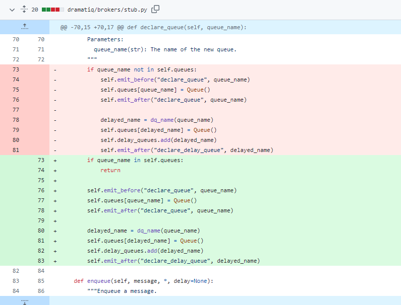

# 1. 보호 구문 (guard clause)
- 아래와 같이 중첩 코드가 생기면 가독성이 매우 떨어짐
```
if(조건)
    if(다른 조건 부정)
        .... 코드.....
```
- 이럴땐 아래와 같이 정리하자
```
if(조건 부정) return 
else(다른 조건) return 
.... 코드.....
```
- 다만 보호 구문을 남용하지 말자 -> 읽기 매우 까다로워짐

<br>


# 2. 안 쓰는 코드
- 실행되지 않는 코드 지워라 -> 코드가 가치가 있으려면 호출되야 함
- 안쓰는 코드는 찾기 어려울 경우도 있음 -> 예로 리플렉션을 여러번 사용하는 코드
  - 코드 지울때 로그 활용해 지우고 실행해보기
- 해당 코드가 나중에 필요하면? 형상 관리를 통해 재사용
- 코드를 정리할 때 '조금'만 삭제 -> 잘못 고친 걸 쉽게 복구 가능
  - '조금'은 주관적

# 3. 대칭으로 맞추기
- 실행되지 않는 코드 지워라 -> 코드가 가치가 있으려면 호출되야 함
- 안쓰는 코드는 찾기 어려울 경우도 있음 -> 예로 리플렉션을 여러번 사용하는 코드
    - 코드 지울때 로그 활용해 지우고 실행해보기
- 해당 코드가 나중에 필요하면? 형상 관리를 통해 재사용
- 코드를 정리할 때 '조금'만 삭제 -> 잘못 고친 걸 쉽게 복구 가능
    - '조금'은 주관적